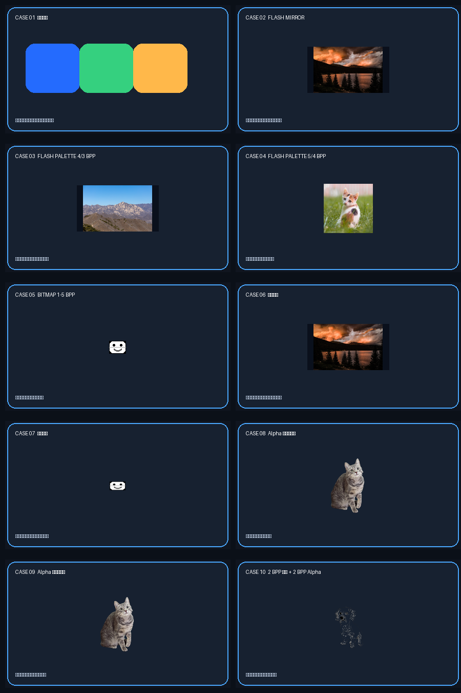

# XGFX 72 MHz 硬件回归测试

## 屏幕顶部怎么读

- 左侧两位蓝色数字是案例号；外部 Flash 识别失败时变红。
- 中间绿色短条表示自动轮播已开启，灰色短条表示手动模式。
- 右侧四位白色数字是本案例绘制耗时，单位为毫秒；黄色双横线是 `ms` 标记。
- 计时使用工程已经初始化的 1 ms SysTick，并读取当前计数值补足亚毫秒精度。它统计实际绘图和 SPI 传输，不统计顶部计时栏自身。

## 按键

- 按键 1 短按：下一个案例。
- 按键 1 长按：开始或停止全部案例自动轮播，每 2.2 秒切换一次。
- 按键 2 短按：回到案例 01。
- 按键 3 长按：黑屏、关闭背光并关机。

## 案例判定

| # | 覆盖内容 | 理想状态 |
|---:|---|---|
| 01 | 矩形、实心/空心圆、四边裁剪 | 图形触碰四边但无回卷、花屏或越界写入 |
| 02 | Flash MIRROR | 山景和金毛显示完整，RGB565 色彩自然 |
| 03 | Flash PALETTE 4/3 BPP | 长城和圣托里尼可辨认，低色深分层正确 |
| 04 | Flash PALETTE 5/4 BPP | 小猫与动画场景正常，无错行 |
| 05 | BITMAP 1/2/3/4/5 BPP | 五个笑脸均完整，位深升高时灰阶更平滑 |
| 06 | Cut_Self、Cut_Screen、Cut 锚点 | 只显示两个裁剪矩形的交集 |
| 07 | 九种 Anchor | 九个小图分别以红点为相应锚点 |
| 08 | MIRROR A4，与 Buffer 像素混合 | 猫透明边缘随红蓝条纹变化 |
| 09 | MIRROR A4，与固定背景混合 | 猫透明边缘只与统一深灰背景混合 |
| 10 | PALETTE 2 BPP + Alpha 2 BPP | 狗的轮廓完整，颜色和透明度均有四级 |
| 11 | PALETTE 4 BPP + Alpha 5 BPP + 双裁剪 | 动漫角色边缘平滑，只在交集内出现 |
| 12 | Alpha 1–5 BPP，与 Buffer 混合 | 五组透明度从硬边逐渐变细腻 |
| 13 | Alpha 1–5 BPP，与固定色混合 | 背景条纹不参与透明混合 |
| 14 | Buffer 绝对坐标与边界裁剪 | 矩形和圆严格限制在 Buffer 区域内 |
| 15 | Buffer Cut_Self + Cut_Screen | 长城只显示两个裁剪范围交集 |
| 16 | MCU MIRROR、MCU PALETTE 3 BPP | 两幅小山景和一幅小猫无需外部 Flash 数据 |
| 17 | MCU PALETTE A2、MCU BITMAP 1/5 BPP | 小透明猫和两种笑脸均正常 |
| 18 | 无效类型、屏外区域、无效 Buffer | 出现绿黄状态条，系统不死机并继续响应按键 |

每个案例的单独参考图位于 `GFX_Test/expected_views/case_01.png` 至 `case_18.png`。参考图用于说明内容与布局，真实屏幕会显示实际量化和混色结果。

## 时钟与结果记录

MCU 主频为 72 MHz。SPI 分频器只能取 2 的幂，无法得到精确 32 MHz，因此屏幕 SPI2 和外部 Flash SPI1 都设置为 `72 / 2 = 36 MHz`，这是最接近 32 MHz 的可用档位。逐个记录基准分支和优化后主分支的 02–17 案例耗时，首次显示可因上电状态略有波动，建议每个案例记录三次并取中值。
